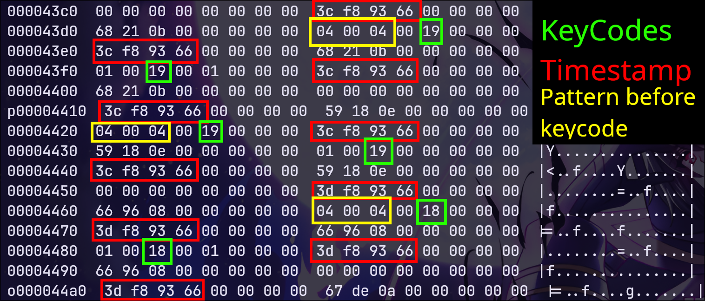
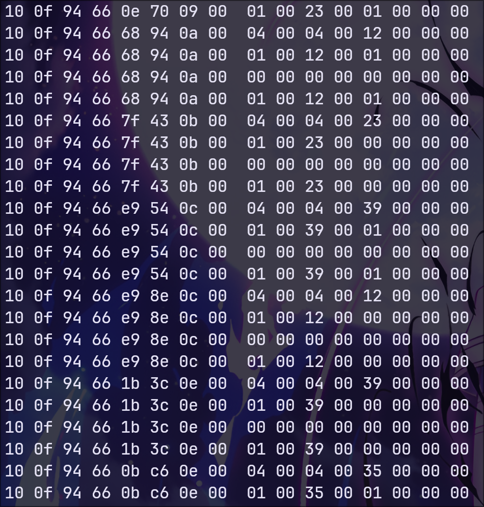

# keylogger

## Introduction

Ceci est un PoC de `keylogger` fait en assembleur et qui fonctionne sur les machines linux. Il utilise directement le driver du clavier pour sniffer les pressions de touches en enregistrant directement le flux binaire du driver dans un fichier. Il est bien évidemment fournit avec le keylogger un script Python permettant d'interpéter le flux binaire. Vous trouverez un peu plus bas, toutes les informations et explications concernant ce projet. J'ai bien entendu commenté le code pour qu'il soit le plus clair et lisible possible.

## Les fichiers

Il y a plusieurs fichiers dans ce dépôt, veuillez noter qu'ils sont tous indépendants, ils représentent simplement l'isolation de certaines fonctionnalités du programme final qui est `global_main.asm`, ils ne sont en aucun cas des fichiers secondaires appelés par le programme principal :

- `write_file.asm` : Programme permettant de lire le contenu d'un fichier.
- `main.asm` : Le keylogger mais qui lit les touches à partir de `stdin`, ce fichier représente le squelette du programme final.
- `capture_driver_stream.asm` : Programme permettant de lire correctement le flux binaire du fichier `/dev/input/event3` qui est celui de mon driver clavier.
- `global_main.asm` : Le keylogger final qui lit le flux binaire et qui l'écrit dans un fichier de notre choix.
- `read_stream.py` : Le script Python permettant d'interpréter le flux binaire représentant l'historique des pressions des touches de clavier.
- `compile.sh` : Un petit script bash que j'ai créé pour compiler facilement mes programmes ASM, car j'en avais marre de le faire manuellement.

## Flux binaire


> [!NOTE]
> Au début, le `keylogger` fonctionnait uniquement en écoutant `stdin`, cependant, si je perds le `focus` et que je fais autre chose, alors il ne pourrait pas sniffer les touches, ce qui fait qu'il perd totalement son utilité en tant que `keylogger`. C'est pour cela qu'il faut le faire fonctionner de manière globale. Pour cela, j'ai essayé d'utiliser la fonction `XNextEvent` du serveur graphique `X11`, cependant, c'était plus délicat et surtout moins satisfaisant puisqu'il n'aurait pas fonctionné sous `Wayland`.. J'ai donc essayé d'exploiter directement le flux binaire du driver de clavier et cette solution fût concluante.

Il est possible de visualiser le flux binaire de votre driver de clavier en consultant le fichier correspondant à celui-ci avec la commande `cat` par exemple. Cependant, cela ne ressemble à rien, c'est pour cela que j'utilise l'utilitaire `hexdump` :

```bash
cat /dev/input/event3 | hexdump -C
```

J'ai réussi à faire sens de ce flux et de déterminer l'historique des touches pressées. Voici comme le flux est structuré :



Lorsque j'ai utilisé le programme et que j'ai affiché le contenu de mon stream enregistré avec la commande suivante :

```bash
cat stream | hexdump -C
```

Alors je me suis retrouvé avec cela :



On remarque alors que la commande `cat` a ajouté des `null bytes` un peu partout. Notre résultat est alors plus propre et plus facilement interprétable que ce que je pensais. En effet, chaque ligne commence avec le timestamp sur les 4 premiers octets et représente une action. J'ai créé le script `read_stream.py` afin de pouvoir automatiser le processus d'intérprétation du flux. J'ai dû créer manuellement la table d'association des octets avec les touches du clavier :


Cependant, ces tables existent sûrement sur internet et dépendent de la version du noyau linux de la machine, c'est pour cela que dans un cas d'utilisation réel de ce `keylogger`, il serait pertinent non seulement d'ajouter une communication avec internet pour transférer ce fichier de flux sur un serveur distant, mais également de prendre l'empreinte de la version du noyau de la machine victime. Notons que ce `keylogger` fonctionne indépendamment du serveur graphique utilisé (X11 ou Wayland) puisqu'il se repose exclusivement sur le driver clavier installé avec le noyau. Voici ce que `read_stream.py` nous renvoit avec mon échantillon :

```
2024-07-14 17:46:52 : s
2024-07-14 17:46:52 : a
2024-07-14 17:46:52 : s
2024-07-14 17:46:52 : a
2024-07-14 17:46:52 : l
2024-07-14 17:46:52 : l
2024-07-14 17:46:52 : u
2024-07-14 17:46:52 : u
2024-07-14 17:46:52 : t
2024-07-14 17:46:52 : t
2024-07-14 17:46:53 :  
2024-07-14 17:46:53 : j
2024-07-14 17:46:53 :  
2024-07-14 17:46:53 : j
2024-07-14 17:46:53 : e
2024-07-14 17:46:53 :  
2024-07-14 17:46:53 : e
2024-07-14 17:46:54 :  
2024-07-14 17:46:54 : m
2024-07-14 17:46:54 : m
2024-07-14 17:46:54 : e
2024-07-14 17:46:54 :  
2024-07-14 17:46:54 : e
2024-07-14 17:46:54 :  
2024-07-14 17:46:54 : p
2024-07-14 17:46:54 : p
2024-07-14 17:46:54 : r
2024-07-14 17:46:54 : r
2024-07-14 17:46:54 : s
2024-07-14 17:46:54 : s
2024-07-14 17:46:54 : n
2024-07-14 17:46:54 : n
2024-07-14 17:46:55 : e
2024-07-14 17:46:55 : e
2024-07-14 17:46:55 : n
2024-07-14 17:46:55 : n
2024-07-14 17:46:55 : t
2024-07-14 17:46:55 : e
2024-07-14 17:46:55 : t
2024-07-14 17:46:55 :  
2024-07-14 17:46:55 : e
2024-07-14 17:46:55 :  
2024-07-14 17:46:56 : h
2024-07-14 17:46:56 : e
2024-07-14 17:46:56 : h
2024-07-14 17:46:56 : e
2024-07-14 17:46:56 : h
2024-07-14 17:46:56 : e
2024-07-14 17:46:56 : h
2024-07-14 17:46:56 :  
2024-07-14 17:46:56 : e
2024-07-14 17:46:56 :  
2024-07-14 17:47:00 : c
sasalluutt j je e mme e pprrssnneenntet e heheheh e c
```

J'ai écrit durant le test : `salut je me présente hehe`. L'accent n'a pas été rentré dans la table d'association et le dernier `c` est celui de l'interruption du programme `^C`. Les espaces sont dans la table d'association donc ils fonctionnent. Reste un seul problème, les répétitions des lettres. Ce problème se résout simplement en considérant le `timestamp` et la sensibilité des touches. Cependant, cela reste un `keylogger` fonctionnel qui enregistre correctement toutes les pressions de touches, il suffit juste de compléter correctement la table d'association.
